## Projet de fin d'année : Les Assistants vocaux & personnels


### Introduction

Cette page Github aura pour sujet les assistants vocaux et personnels.

En effet, que ce soit à travers nos appareils connectés ou au sein même de notre environnement les assistants vocaux/personnels ont pris une place importante dans le quotidien des usagers.
Ce dossier documentaire tentera de percer au mieux cette technologie. À travers les différentes recherches effectuées, un ensemble de sources ont été compilés pour répondre au mieux aux différentes interrogations qui peut exsiter, lorsqu'il est question d'assistants vocaux et personnels : 
```
- Une définition de la technologie étudiée et son fonctionnement.
- Son histoire et sa création.
- L'évolution de cette technique et les défis qui l'attendent.
- Les possibles dérives de cette technique.
```
L'organisation de ce documentaire suivra donc cette structure et inscrira à chaque fois les sources mises en lien à travers 
les images.
 
DROUGLAZET, Klervi. « L’IA de Google Home et Assistant rompt (enfin) la barrière de la langue, et va même plus loin... » [en ligne]. In L’usine-digitale. Mise en ligne le 19 mai 2017 [Consulté le 10 juin 2020]. Disponible sur le Web: <https://www.usine-digitale.fr/article/l-ia-de-google-home-et-assistant-rompt-enfin-la-barriere-de-la-langue-et-va-meme-plus-loin.N542584>


### 1. Définition et Fonctionnement 
- WIKIPEDIA. « Assistant personnel intelligent » [en ligne]. In Wikipédia, l’encyclopédie libre. Mise à jour le 27 avril 2020 [Consulté le 10 juin 2020]. Disponible sur le Web : <https://fr.wikipedia.org/wiki/Assistant_personnel_intelligent>
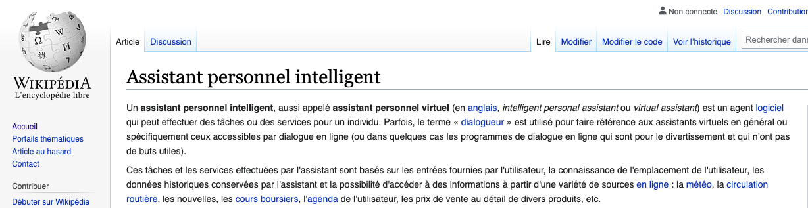
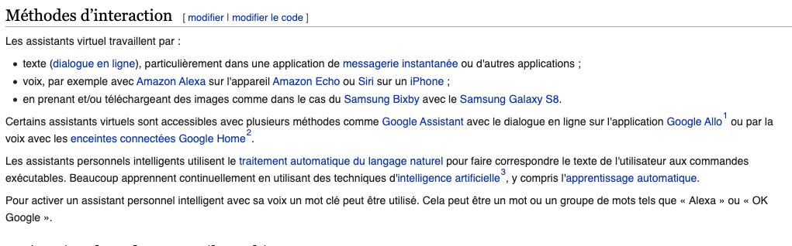
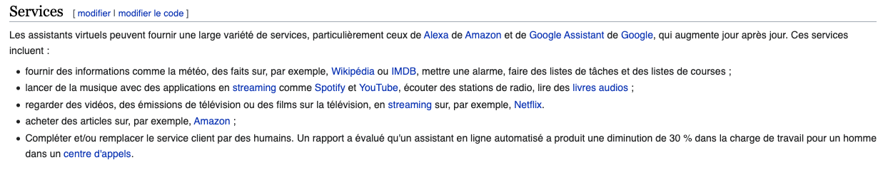

- COMMISSION NATIONALE DE L'INFORMATIQUE ET DES LIBERTÉS (CNIL). « Enceintes intelligentes : des assistants vocaux connectés à votre vie privée » [en ligne]. In CNIL. Mise en ligne le 20 décembre 2018 [Consulté le 10 juin 2020]. Disponible sur le Web : <https://www.cnil.fr/fr/enceintes-intelligentes-des-assistants-vocaux-connectes-votre-vie-privee>
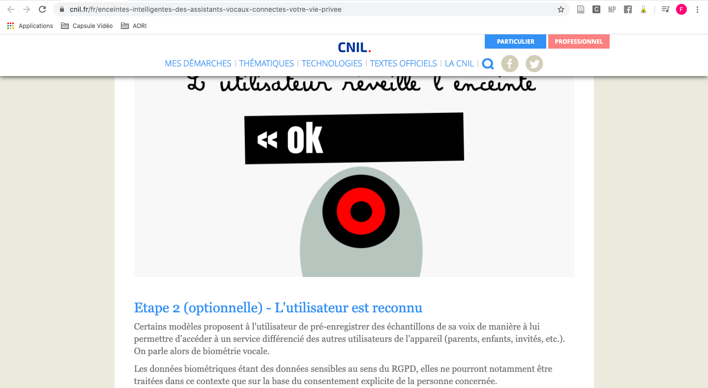

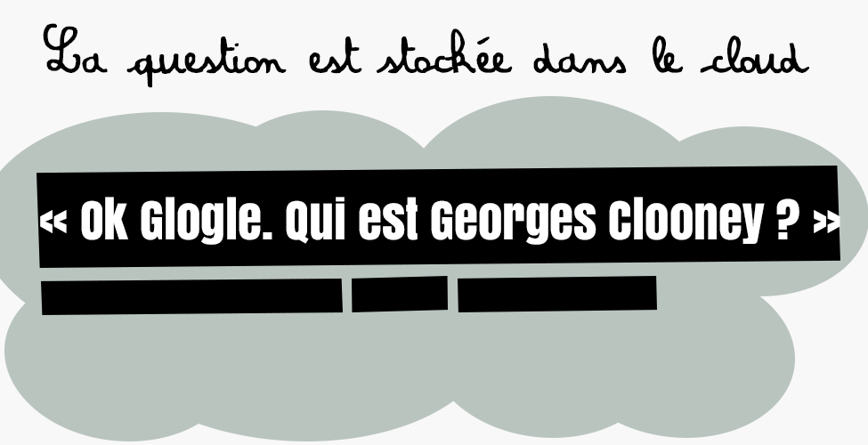
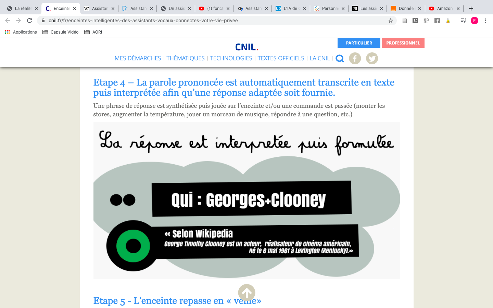

- BELLAMY, Alexandra. « Assistants domestiques et assistance vocale : tout ce qu’il faut savoir » [en ligne]. In Home énergie.  Mise en ligne le 19 juin 2019 [Consulté le 10 juin 2020]. Disponible sur le Web : <https://homenergie.maison-travaux.fr/homenergie/solutions-du-quotidien-home-energie/objets-connectes-home-energie/assistants-domestiques-assistance-vocale-quil-faut-savoir-247154.html>
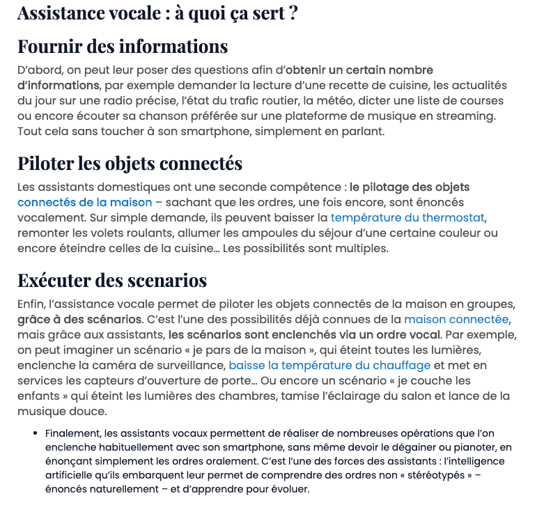
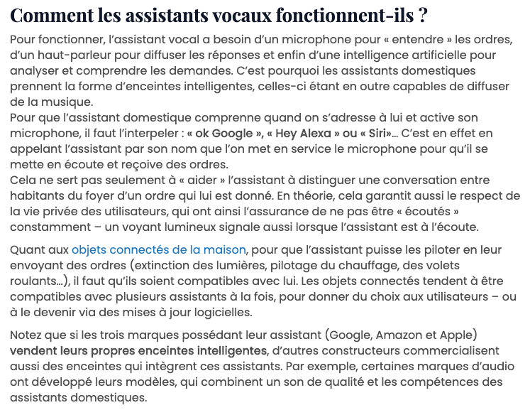

- TECHNOÏDES ASSOCIÉS. « fonctionnement assistant vocal » [en ligne]. In Google. Youtube. Mise en ligne le 16 septembre 2017 [Consulté le 10 juin 2020]. Disponible sur le Web : <https://www.youtube.com/watch?v=1ZnYok0nvwA&feature=youtu.be>
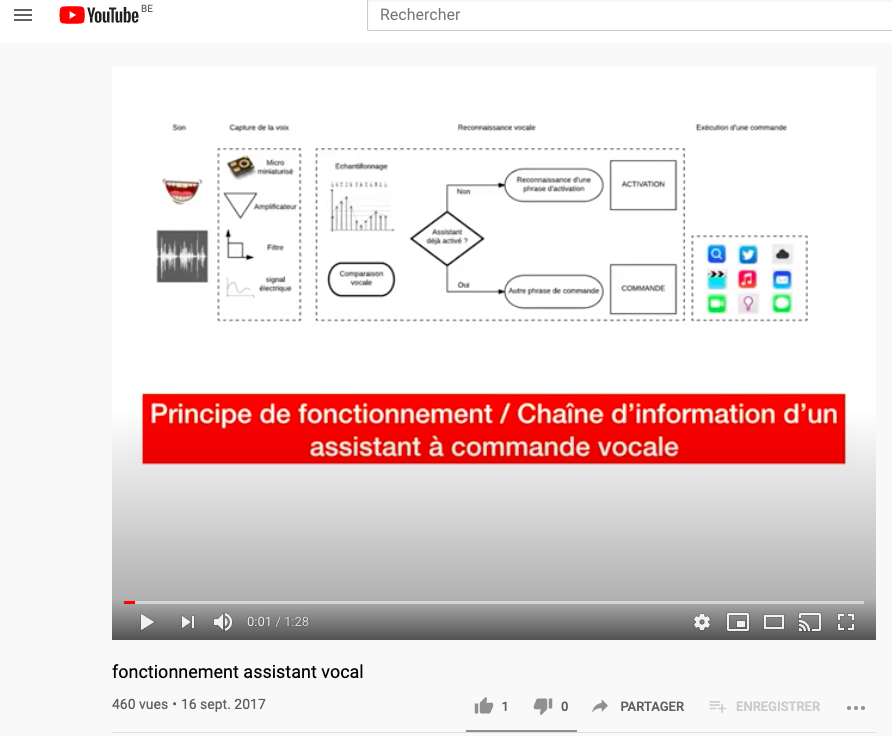


### 2. Quelques mots sur l'histoire 
- WIKIPEDIA. « Assistant personnel intelligent » [en ligne]. In Wikipédia, l’encyclopédie libre. Mise à jour le 27 avril 2020 [Consulté le 10 juin 2020]. Disponible sur le Web : <https://fr.wikipedia.org/wiki/Assistant_personnel_intelligent>
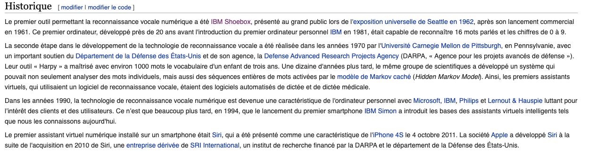


### 3. Évolutions & Défis 
- BELLAMY, Alexandra. « Assistants domestiques et assistance vocale : tout ce qu’il faut savoir » [en ligne]. In Home énergie.  Mise en ligne le 19 juin 2019 [Consulté le 10 juin 2020]. Disponible sur le Web : <https://homenergie.maison-travaux.fr/homenergie/solutions-du-quotidien-home-energie/objets-connectes-home-energie/assistants-domestiques-assistance-vocale-quil-faut-savoir-247154.html>
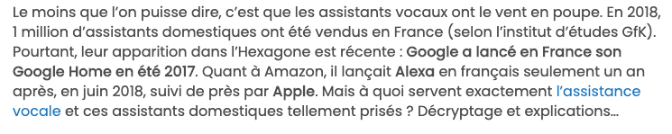

- WIKIPEDIA. « Assistant personnel intelligent » [en ligne]. In Wikipédia, l’encyclopédie libre. Mise à jour le 27 avril 2020 [Consulté le 10 juin 2020]. Disponible sur le Web : <https://fr.wikipedia.org/wiki/Assistant_personnel_intelligent>
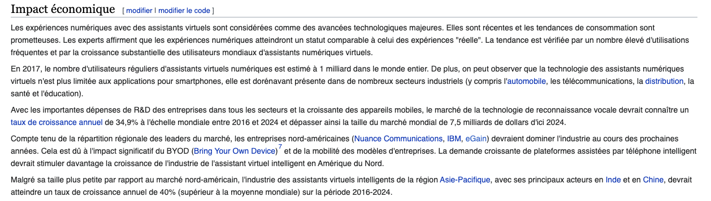
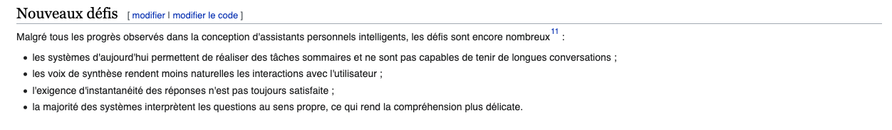

- MONNEAUX, Fanny. « Assistant personnel: les tendances de demain » [en ligne].  LExpress.fr. 28 novembre 2016 [Consulté le 10 juin 2020]. Disponible sur le Web : <https://www.lexpress.fr/tendances/produit-high-tech/assistant-personnel-les-tendances-de-demain_1849633.html> 

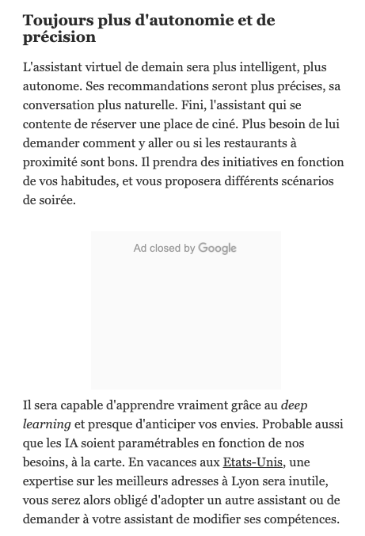
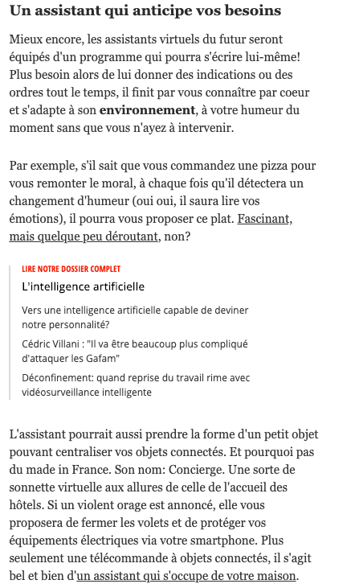

### 4. Leurs Dérives


You can use the [editor on GitHub](https://github.com/FarahMrbt/assperso/edit/master/index.md) to maintain and preview the content for your website in Markdown files.

Whenever you commit to this repository, GitHub Pages will run [Jekyll](https://jekyllrb.com/) to rebuild the pages in your site, from the content in your Markdown files.

### Markdown

Markdown is a lightweight and easy-to-use syntax for styling your writing. It includes conventions for

```markdown
Syntax highlighted code block

# Header 1
## Header 2
### Header 3

- Bulleted
- List

1. Numbered
2. List

**Bold** and _Italic_ and `Code` text

[Link](url) and 
```

For more details see [GitHub Flavored Markdown](https://guides.github.com/features/mastering-markdown/).

### Jekyll Themes

Your Pages site will use the layout and styles from the Jekyll theme you have selected in your [repository settings](https://github.com/FarahMrbt/assperso/settings). The name of this theme is saved in the Jekyll `_config.yml` configuration file.

### Support or Contact

Having trouble with Pages? Check out our [documentation](https://help.github.com/categories/github-pages-basics/) or [contact support](https://github.com/contact) and we’ll help you sort it out.
