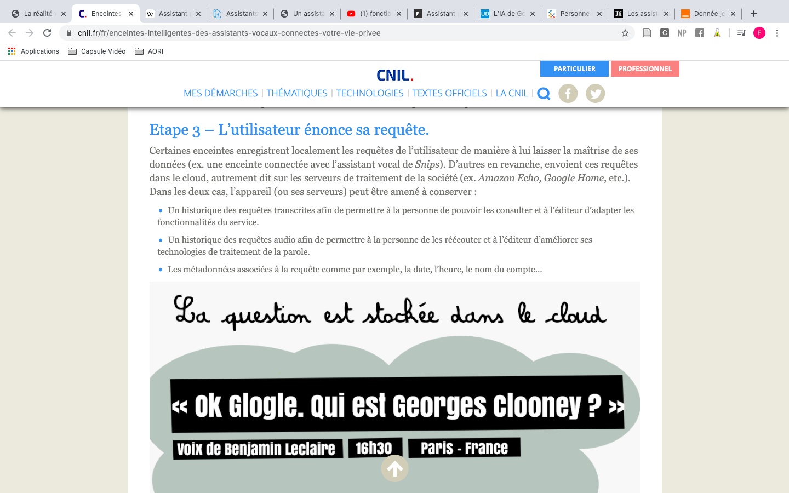

# Projet de fin d'année : Les Assistants vocaux & personnels


## _Introduction_

Cette page Github aura pour sujet les assistants vocaux et personnels.

En effet, que ce soit à travers nos appareils connectés ou au sein même de notre environnement les assistants vocaux/personnels ont pris une place importante dans le quotidien des usagers.
Ce dossier documentaire tentera de percer au mieux cette technologie. À travers les différentes recherches effectuées, un ensemble de sources ont été compilés pour répondre au mieux aux différentes interrogations qui peut exsiter, lorsqu'il est question d'assistants vocaux et personnels : 
```
- Une définition de la technologie étudiée et son fonctionnement.
- Son histoire et sa création.
- L'évolution de cette technique et les défis qui l'attendent.
- Les possibles dérives de cette technique.
```
L'organisation de ce documentaire suivra donc cette structure et inscrira à chaque fois les sources mises en lien à travers 
les images.
 
DROUGLAZET, Klervi. « L’IA de Google Home et Assistant rompt (enfin) la barrière de la langue, et va même plus loin... » [en ligne]. In _L’usine-digitale._ Mise en ligne le 19 mai 2017 [Consulté le 10 juin 2020]. Disponible sur le Web: <https://www.usine-digitale.fr/article/l-ia-de-google-home-et-assistant-rompt-enfin-la-barriere-de-la-langue-et-va-meme-plus-loin.N542584>


## 1. _Définition et Fonctionnement_

- BRUCO, Marie-Isabelle. « Assistants Vocaux, nouvel eldorado du marketing numérique ? » [en ligne]. In MBAMCI. Assistants Vocaux, nouvel eldorado du marketing numérique ?. Mise en ligne le 27 mai 2017 [consulté le 10 juin 2020]. Disponible sur le Web : < https://mbamci.com/assistants-vocaux-nouvel-eldorado/ >


- WIKIPEDIA. « Assistant personnel intelligent » [en ligne]. In _Wikipédia, l’encyclopédie libre._ Mise à jour le 27 avril 2020 [Consulté le 10 juin 2020]. Disponible sur le Web : <https://fr.wikipedia.org/wiki/Assistant_personnel_intelligent>


- COMMISSION NATIONALE DE L'INFORMATIQUE ET DES LIBERTÉS (CNIL). « Enceintes intelligentes : des assistants vocaux connectés à votre vie privée » [en ligne]. In _CNIL._ Mise en ligne le 20 décembre 2018 [Consulté le 10 juin 2020]. Disponible sur le Web : <https://www.cnil.fr/fr/enceintes-intelligentes-des-assistants-vocaux-connectes-votre-vie-privee>




- BELLAMY, Alexandra. « Assistants domestiques et assistance vocale : tout ce qu’il faut savoir » [en ligne]. In _Home énergie._  Mise en ligne le 19 juin 2019 [Consulté le 10 juin 2020]. Disponible sur le Web : <https://homenergie.maison-travaux.fr/homenergie/solutions-du-quotidien-home-energie/objets-connectes-home-energie/assistants-domestiques-assistance-vocale-quil-faut-savoir-247154.html>


- TECHNOÏDES ASSOCIÉS. « fonctionnement assistant vocal » [en ligne]. In Google. _Youtube._ Mise en ligne le 16 septembre 2017 [Consulté le 10 juin 2020]. Disponible sur le Web : <https://www.youtube.com/watch?v=1ZnYok0nvwA&feature=youtu.be>


## 2. _Quelques mots sur l'histoire_

- WIKIPEDIA. « Assistant personnel intelligent » [en ligne]. In _Wikipédia, l’encyclopédie libre._ Mise à jour le 27 avril 2020 [Consulté le 10 juin 2020]. Disponible sur le Web : <https://fr.wikipedia.org/wiki/Assistant_personnel_intelligent>


## 3. _Évolutions & Défis_

- TALBI, Ilyes. « Personne n’aime parler à une IA : le problème des assistants vocaux » [en ligne]. In  _La revue IA._ Mise en ligne le 9 avril 2020 [Consulté le 10 juin 2020]. Disponible sur le Web : <https://larevueia.fr/personne-naime-parler-a-une-machine/>


- BELLAMY, Alexandra. « Assistants domestiques et assistance vocale : tout ce qu’il faut savoir » [en ligne]. In _Home énergie._  Mise en ligne le 19 juin 2019 [Consulté le 10 juin 2020]. Disponible sur le Web : <https://homenergie.maison-travaux.fr/homenergie/solutions-du-quotidien-home-energie/objets-connectes-home-energie/assistants-domestiques-assistance-vocale-quil-faut-savoir-247154.html>


- WIKIPEDIA. « Assistant personnel intelligent » [en ligne]. In _Wikipédia, l’encyclopédie libre._ Mise à jour le 27 avril 2020 [Consulté le 10 juin 2020]. Disponible sur le Web : <https://fr.wikipedia.org/wiki/Assistant_personnel_intelligent>


- MONNEAUX, Fanny. « Assistant personnel: les tendances de demain » [en ligne].  _LExpress.fr._ 28 novembre 2016 [Consulté le 10 juin 2020]. Disponible sur le Web : <https://www.lexpress.fr/tendances/produit-high-tech/assistant-personnel-les-tendances-de-demain_1849633.html> 


## 4. Leurs Dérives

- MICHEL. « Un assistant vocal : comment ça marche? » [en ligne]. In _L’origine._ [Consulté le 10 juin 2020]. Disponible sur le Web : <https://www.lorigine.fr/un-assistant-vocal-comment-ca-marche/> 


- COMMISSION NATIONALE DE L'INFORMATIQUE ET DES LIBERTÉS (CNIL). « Enceintes intelligentes : des assistants vocaux connectés à votre vie privée » [en ligne]. In _CNIL._ Mise en ligne le 20 décembre 2018 [Consulté le 10 juin 2020]. Disponible sur le Web : <https://www.cnil.fr/fr/enceintes-intelligentes-des-assistants-vocaux-connectes-votre-vie-privee>


- CNEWS. « Amazon : les employés écoutent les conversations grâce à l’assistant vocal Alexa » [en ligne]. in Google. 
_Youtube._ Mise en ligne le 12 avril 2019 [Consulté le 10 juin 2020]. Disponible sur le Web : <https://www.youtube.com/watch?v=mwQzIC2FyJo>


- ORANGE. « Donnée je t’aime, épisode 1 : les assistants vocaux » [en ligne]. In _Orange France._ Publié le 11 décembre 2019 [Consulté le 10 juin 2020]. Disponible sur le Web : <https://orangecyberdefense.com/fr/insights/blog/fuite_de_donnees/donnee-je-taime-1-les-assistants-vocaux/>


- LE MONDE. « Les assistants vocaux renforcent les stéréotypes sexistes, selon un rapport de l’ONU » [en ligne]. _Le Monde.fr._ Mise en ligne le 22 mai 2019 [Consulté le 10 juin 2020]. Disponible sur le Web : <https://www.lemonde.fr/pixels/article/2019/05/22/les-assistants-vocaux-renforcent-les-stereotypes-sexistes-selon-un-rapport-de-l-onu_5465684_4408996.html>


